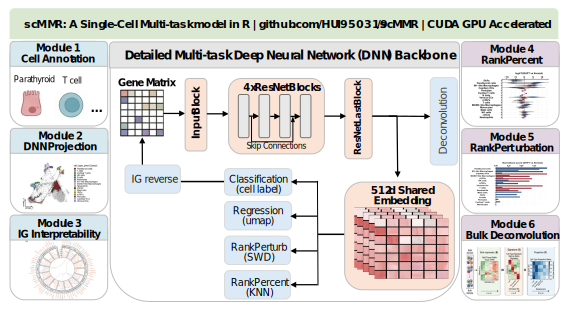

# scMMR 

<!-- badges: start -->
[](https://opensource.org/licenses/MIT)
[](https://cran.r-project.org/)
[](https://github.com/HUI950319/scMMR)
[](https://hui950319.github.io/scMMR/)
[](https://lifecycle.r-lib.org/articles/stages.html)
<!-- badges: end -->

**Single-Cell Multi-Task Model in R** — A comprehensive toolkit for single-cell RNA-seq analysis powered by PyTorch multi-task deep neural networks.

<p align="center">
  
</p>

## Overview

scMMR trains a shared ResNet backbone that jointly learns **cell type classification** and **embedding regression** (e.g., UMAP coordinates), producing a unified 512-dimensional cell representation that powers an end-to-end single-cell analysis ecosystem:

- **Cell type prediction** with OOD (out-of-distribution) detection
- **Bulk RNA-seq deconvolution** for cell type proportion estimation
- **Gene importance attribution** via Integrated Gradients
- **Pathway enrichment analysis** (GSEA & SCPA) with 16 bundled GMT databases
- **Perturbation ranking** using Wasserstein, MMD, and energy distance metrics
- **Pseudotime trajectory analysis** with CytoTRACE 2 integration
- **Quality control** including doublet detection and ambient RNA estimation
- **Rich visualization suite** (alluvial, bubble, scatter, beeswarm, GSEA plots, and more)

## Six Modules

Around a shared ResNet backbone and a 512-d embedding, scMMR organizes its functionality into **six modules** that cover the main tasks of single-cell analysis. Modules 1–3 hang directly off the multi-task heads; Modules 4–5 operate on the frozen 512-d embedding; Module 6 reuses the backbone with a dedicated decoder head.

### Module 1 — DNN Cell Type Annotation
Reference-based cell type prediction driven by the **classification head** `Linear(512, 256) → SELU → Dropout(0.1) → Linear(256, K)`. Trained with cross-entropy + label smoothing (ε = 0.1), calibrated via **temperature scaling**, and equipped with **OOD detection** (max softmax probability below threshold → *Unknown*). In the reference parathyroid atlas K = 16 cell types.
> **Key functions:** `DNN_train()`, `DNN_predict()`, `PlotAlluvia()`, `PlotAnnotation()`

### Module 2 — DNN Projection & PlotMAP
Reference projection that maps query cells onto the reference UMAP (or any 2-D embedding) without re-integrating the data. A **regression head** is trained with MSE on z-scored UMAP coordinates, and at inference time `DNN_predict()` uses a **kNN-softmax** (k = 30, τ = 10) over L2-normalized 512-d embeddings of the reference, yielding projected coordinates plus a per-cell confidence score (which `PlotMAP()` then visualizes). Stratified subsampling caps the reference at 1,000 cells per type / 20,000 total.
> **Key functions:** `DNN_predict()`, `PlotMAP()`, `EvaluateEmbedding()`, `DimPlot2()`, `FeaturePlot2()`

### Module 3 — IG Interpretability
Gene-level attribution via **Integrated Gradients** (Sundararajan 2017) with an all-zero baseline and `n = 50` integration steps, batched at 200 cells per pass. Attributions are lifted to higher layers through bundled databases: **Gene → Pathway (GMT, 16 databases) → Regulon (SCENIC)**. Pathway scoring aggregates `|IG|` through a binary gene×pathway mask normalized by pathway size (min 5 overlapping genes). Works in both global and per-cell-type modes.
> **Key functions:** `DNN_predict(explain = TRUE)`, `PlotImportance()`, `RunPathwayAnalysis()`, `PlotPathwayBubble()`

### Module 4 — RankPercent (differential abundance)
Differential cell-type abundance in the shared embedding space, inspired by **miloR** (Dann 2022). Steps: (1) build a kNN graph (k = 30) on the 512-d embedding via `FNN`; (2) sample neighborhoods at proportion 0.2; (3) count cells per type × condition; (4) apply **Fisher's exact test** per type; (5) correct p-values with Benjamini–Hochberg FDR. Requires ≥ 10 cells per type. Output: **log-FC + adjusted p-value** per cell type.
> **Key functions:** `RankPercent()`, `PlotPercent()`

### Module 5 — RankPerturbation (expression perturbation)
Condition-level perturbation ranking, inspired by **Augur** (Skinnider 2021). For each cell type, scMMR extracts the first 20 PCs of the 512-d embedding and computes a distribution distance between the two conditions — default **Sliced Wasserstein Distance** (L = 50 projections), with **MMD / Energy distance / AUC** as alternatives. Significance is assessed via **1,000 label-permutation tests** + BH FDR (min 5 cells per type). Output: ranked cell types with a normalized perturbation score.
> **Key functions:** `RankPerturbation()`, `PlotPerturbation()`, `PlotRankScatter()`

### Module 6 — DNN Bulk Deconvolution
Cell-type proportion estimation from bulk RNA-seq, inspired by **TAPE** (Chen 2022). Reuses the same ResNet backbone but switches the input to `log1p(CPM)` for continuous bulk expression. The training set is **5,000 pseudo-bulks** generated by sampling proportions from `Dirichlet(α = 1)` and aggregating 500 cells per sample from the single-cell reference. A **proportion head** is followed by a 5-layer linear **decoder** `K → 64 → 128 → 256 → 512 → n_genes` whose weight product gives an interpretable signature matrix. Training loss: `L_prop + 0.1·L_recon` with an **adaptive fine-tuning** stage on the target bulk.
> **Key functions:** `DNN_deconv_train()`, `DNN_deconv_predict()`, `PlotPropCorrelation()`

| # | Module | Core task | Head / Source | Algorithm (key params) | Representative output |
|---|--------|-----------|----------------|-------------------------|-----------------------|
| 1 | Cell Type Annotation | Cell type prediction | Classification head | CE + label smoothing (ε = 0.1), temperature scaling, OOD threshold | Labels + calibrated probs, Unknown flag |
| 2 | DNN Projection & PlotMAP | Reference UMAP projection | Regression head | MSE on z-UMAP + kNN-softmax (k = 30, τ = 10) on L2-norm 512-d | 2-D projected coords + confidence |
| 3 | IG Interpretability | Gene / pathway / regulon attribution | IG on backbone | Integrated Gradients (n = 50, x′ = 0), GMT + SCENIC | Top genes, pathway scores, regulon drivers |
| 4 | RankPercent | Differential abundance | 512-d embedding (kNN) | kNN (k = 30) + Fisher exact + BH FDR (inspired by miloR) | log-FC + p_adj per cell type |
| 5 | RankPerturbation | Expression perturbation ranking | 512-d embedding (distance) | SWD (L = 50) / MMD / Energy / AUC + 1,000 permutations (inspired by Augur) | Ranked cell types + perturbation score |
| 6 | Bulk Deconvolution | Bulk cell-type proportions | Deconvolution head + decoder | Dirichlet(α = 1) pseudo-bulk (N = 5,000) + TAPE decoder + adaptive stage | Proportion matrix (samples × types), sigmatrix |

## Benchmark

scMMR was benchmarked against 11 other cell type annotation methods (12 methods in total) across 7 datasets (4 public pancreas + 3 parathyroid datasets), evaluating annotation quality, cross-dataset generalization, scalability, and robustness.

<p align="center">
  
</p>

**Figure 3B.** Comprehensive benchmark of 12 cell type annotation methods. scMMR ranks 1st overall (scIB-style weighted score: 40% Annotation + 25% Generalization + 15% Scalability + 10% Robustness + 10% Usability). Scalability metrics are based on 100K cells with literature-validated estimates (Abdelaal 2019, Huang & Zhang 2021, scaLR 2025).

## Architecture

scMMR's backbone follows a multi-task residual design inspired by **scMMT** (Chen et al.):

```
Binary Input (cells × 6000 HVGs, non-zero → 1)
  ↓ InputBlock      : BatchNorm → Dropout(0.25) → Linear(6000, 512) → SELU
  ↓ 4 × ResNetBlock : Dropout(0.1) → Linear(512, 512) → SELU + skip connection
  ↓ ResNetLastBlock : (no skip) → 512-d Shared Embedding
  ├→ Classification head : Linear(512,256) → SELU → Drop(0.1) → Linear(256, K)
  │                        CE + label smoothing (ε = 0.1) + temperature scaling
  └→ Regression head     : Linear(512,256) → SELU → Drop(0.1) → Linear(256, D)
                           MSE on z-scored UMAP (D = 2 by default)
```

**Training & optimization.** Adam (lr = 1 × 10⁻³) + CosineAnnealingWarmRestarts (T₀ = 10); batch size 256; early stopping patience = 10. The two-task loss
`L_total = w_cls · L_cls + w_reg · L_reg`
is rebalanced on-the-fly by **GradNorm** (Chen 2018, α = 0.15), so classification and regression converge at comparable rates without manual tuning.

**Backend.** PyTorch under the hood (`inst/python/`) called from R through **reticulate**, with automatic CUDA detection for GPU acceleration.

## Installation

### 1. Install the R package

```r
# Install from GitHub
devtools::install_github("HUI950319/scMMR")
```

### 2. Set up Python environment

scMMR requires Python (≥ 3.8) with PyTorch and scanpy. You can either create a new environment or use an existing one:

```r
library(scMMR)

# Option A: Auto-install a conda environment (CPU)
install_scMMR_python()

# Option A (with GPU): Auto-install with CUDA support
install_scMMR_python(gpu = TRUE)

# Option B: Use an existing conda environment
use_scMMR_python(condaenv = "your-env-name")
```

## Quick Start

The following snippets walk through all **six modules** in order. Load the package and initialize the Python environment once at the top:

```r
library(scMMR)
use_scMMR_python(condaenv = "scMMR")  # replace with your own conda env name
```

### Train the multi-task DNN backbone

```r
# Train once — the same model powers Modules 1–3
DNN_train(
  input         = seurat_ref,        # Seurat object or "reference.h5ad"
  label_column  = "cell_type",
  embedding_key = "umap",            # key in obsm / reduction
  save_path     = "model.pt",
  n_top_genes   = 6000,
  num_epochs    = 50,
  device        = "auto"             # auto-detect GPU
)
```

### Module 1 — DNN Cell Type Annotation

```r
# Reference-based cell type prediction with OOD detection
result <- DNN_predict(
  query      = seurat_query,         # or "query.h5ad"
  model_path = "model.pt",
  explain    = TRUE                  # also fills Module 3 outputs
)

result$predictions    # cell type labels + confidence + OOD flags

# Visualize label flow between reference and query
PlotAlluvia(result$predictions, from = "ref_label", to = "pred_label")
```

### Module 2 — DNN Projection & PlotMAP

```r
# Query cells projected onto the reference UMAP (regression head)
proj_umap <- result$embedding        # n_cells × D coordinates
PlotMAP(proj_umap, labels = result$predictions$pred_label)

# Evaluate projection quality against ground truth (optional)
EvaluateEmbedding(proj_umap, labels = seurat_query$cell_type)
```

### Module 3 — IG Interpretability

```r
# Per-cell-type gene importance from Integrated Gradients
PlotImportance(result$importance, top_n = 20)

# Lift gene attributions to pathway-level scores
pa_result <- RunPathwayAnalysis(
  seurat_obj,
  group_by  = "cell_type",
  split_by  = "condition",
  gene_sets = "hallmark",
  method    = "gsea"
)
PlotPathwayBubble(pa_result)
```

### Module 4 — RankPercent (differential abundance)

```r
# KNN-based log-FC of cell-type proportions across conditions
da <- RankPercent(
  seurat_obj,
  group_by = "cell_type",
  split_by = "condition",
  ref      = "control"
)
PlotPercent(da)
```

### Module 5 — RankPerturbation (expression perturbation)

```r
# Rank cell types by embedding-space perturbation between conditions
ranks <- RankPerturbation(
  embedding = result$embedding,
  group_col = "condition",
  ref_group = "control",
  metrics   = c("wasserstein", "mmd")
)
PlotPerturbation(ranks)
PlotRankScatter(ranks)
```

### Module 6 — DNN Bulk Deconvolution

```r
# Train a dedicated deconvolution head from the single-cell reference
DNN_deconv_train(
  input        = seurat_ref,
  label_column = "cell_type",
  save_path    = "deconv_model.pt"
)

# Estimate cell-type proportions from bulk RNA-seq
props <- DNN_deconv_predict(
  bulk_input = "bulk_expression.csv",
  model_path = "deconv_model.pt"
)
PlotPropCorrelation(props, truth = ground_truth_props)
```

## Bundled Gene Set Databases

scMMR ships with 16 GMT files in `inst/extdata/gmt/`:

| Database | Human | Mouse |
|----------|-------|-------|
| Hallmark (MSigDB) | `h.all.v2022.1.Hs.symbols.gmt` | — |
| KEGG Legacy | `c2.cp.kegg.v2022.1.Hs.symbols.gmt` | — |
| Reactome | `reactome.gmt` | `m_reactome.gmt` |
| GO Biological Process | `GO_bp.gmt` | `m_GO_bp.gmt` |
| Transcription Factors | `TF.gmt` | `m_TF.gmt` |
| Immune Signatures | `immune.gmt` | — |
| CollecTRI Regulons | `collectri.human.gmt` | — |
| PROGENy Signaling | `progeny.human.top500.gmt` | — |
| Proliferation | `proliferation.combined.gmt` | — |

## Key Functions

| Category | Functions |
|----------|-----------|
| **Training & Prediction** | `DNN_train()`, `DNN_predict()`, `DNN_deconv_train()`, `DNN_deconv_predict()` |
| **Pathway Analysis** | `RunPathwayAnalysis()`, `RunGseaEnrich()`, `RunGsea()`, `RunTraceGSEA()` |
| **Gene Set Scoring** | `ComputeModuleScore()`, `read_gmt()`, `parse_gene_sets()` |
| **Ranking** | `RankPerturbation()`, `RankPercent()` |
| **Trajectory** | `RunCytoTRACE2()`, `RunTraceGene()`, `PlotDynamicFeatures()` |
| **Differential Expression** | `RunDE()`, `RunCorrelation()` |
| **Quality Control** | `ComputeDoublets()`, `ComputeAmbientRNA()`, `StandardPipeline()` |
| **Embedding Evaluation** | `EvaluateEmbedding()`, `PlotEmbeddingEval()` |
| **Visualization** | `PlotPathwayBubble()`, `PlotAlluvia()`, `PlotImportance()`, `PlotPerturbation()`, `PlotPercent()`, `PlotRankScatter()`, `PlotGsea()`, `PlotDE()`, `PlotCytoTRACE2()`, `PlotScatter()`, `PlotMAP()` |

## Demo Scripts

Example workflows are available in `inst/demo/`:

- `demo_predict_and_plot.R` — Full prediction + visualization pipeline
- `demo_deconvolution.R` — Bulk deconvolution workflow
- `demo_benchmark_classification.R` — DNN vs SVM/RF/KNN benchmarks
- `demo_pathway_analysis.R` — GSEA & SCPA pathway analysis
- `demo_compute_module_score.R` — Gene set scoring with AUCell/Seurat/UCell
- `demo_evaluate_embedding.R` — Embedding quality assessment
- `demo_cytotrace.R` — Pseudotime trajectory analysis

## System Requirements

- **R** ≥ 4.0.0
- **Python** ≥ 3.8 with: torch, scanpy, anndata, numpy, pandas, scipy
- **GPU** (optional): CUDA-compatible GPU for accelerated training

## Documentation

Full function reference and vignettes are available on the [pkgdown site](https://hui950319.github.io/scMMR/).

## Citation

If you use scMMR in your research, please cite:

```
Ouyang H. (2026). scMMR: Single-Cell Multi-Task Model in R.
R package version 0.3.0. https://github.com/HUI950319/scMMR
```

## License

MIT © Hui Ouyang
