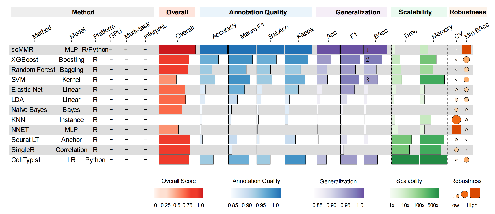

# scMMR

**Single-Cell Multi-Task Model in R** — A comprehensive toolkit for
single-cell RNA-seq analysis powered by PyTorch multi-task deep neural
networks.

## Overview

scMMR trains a shared ResNet backbone that jointly learns **cell type
classification** and **embedding regression** (e.g., UMAP coordinates),
producing a unified 512-dimensional cell representation. Built on top of
this representation, scMMR provides:

- **Cell type prediction** with OOD (out-of-distribution) detection
- **Bulk RNA-seq deconvolution** for cell type proportion estimation
- **Gene importance attribution** via Integrated Gradients
- **Pathway enrichment analysis** (GSEA & SCPA) with 16 bundled GMT
  databases
- **Perturbation ranking** using Wasserstein, MMD, and energy distance
  metrics
- **Pseudotime trajectory analysis** with CytoTRACE 2 integration
- **Quality control** including doublet detection and ambient RNA
  estimation
- **Rich visualization suite** (alluvial, bubble, scatter, beeswarm,
  GSEA plots, and more)

## Benchmark

scMMR was benchmarked against 11 cell type annotation methods across 7
datasets (4 public pancreas + 3 parathyroid datasets), evaluating
annotation quality, cross-dataset generalization, scalability, and
robustness.



**Figure 3B.** Comprehensive benchmark of 12 cell type annotation
methods. scMMR ranks 1st overall (scIB-style weighted score: 40%
Annotation + 25% Generalization + 15% Scalability + 10% Robustness + 10%
Usability). Scalability metrics are based on 100K cells with
literature-validated estimates (Abdelaal 2019, Huang & Zhang 2021, scaLR
2025).

## Architecture

    Binary Input (gene × cell)
      ↓ InputBlock (BatchNorm → Dropout → Linear 512 → SELU)
      ↓ ResNetBlock ×4 (512-dim with skip connections)
      ↓ Shared 512-dim embedding
      ├→ ClassificationHead → K cell types (with label smoothing)
      └→ RegressionHead → D embedding dims (e.g., UMAP)

Multi-task loss is balanced dynamically via **GradNorm**.

## Installation

### 1. Install the R package

``` r
# Install from GitHub
devtools::install_github("HUI950319/scMMR")
```

### 2. Set up Python environment

scMMR requires Python (≥ 3.8) with PyTorch and scanpy. You can either
create a new environment or use an existing one:

``` r
library(scMMR)

# Option A: Auto-install a conda environment (CPU)
install_scMMR_python()

# Option A: Auto-install with GPU support
install_scMMR_python(gpu = TRUE)

# Option B: Use an existing conda environment
use_scMMR_python(condaenv = "your-env-name")
```

## Quick Start

### Train a model

``` r
library(scMMR)
use_scMMR_python(condaenv = "scMMR")

# Train on a Seurat object or h5ad file
DNN_train(
  input         = seurat_ref,        # or "reference.h5ad"
  label_column  = "cell_type",
  embedding_key = "umap",            # key in obsm / reduction
  save_path     = "model.pt",
  n_top_genes   = 6000,
  num_epochs    = 50,
  device        = "auto"             # auto-detect GPU
)
```

### Predict cell types

``` r
result <- DNN_predict(
  query      = seurat_query,         # or "query.h5ad"
  model_path = "model.pt",
  explain    = TRUE,                 # compute gene importance
  pathway_gmt = "reactome.gmt"      # pathway-level scoring
)

# Access results
result$predictions    # cell type predictions with confidence
result$importance     # gene importance rankings
result$pathway_scores # pathway-level importance scores
```

### Bulk deconvolution

``` r
# Train deconvolution model from single-cell reference
DNN_deconv_train(
  input        = seurat_ref,
  label_column = "cell_type",
  save_path    = "deconv_model.pt"
)

# Estimate cell type proportions from bulk RNA-seq
props <- DNN_deconv_predict(
  bulk_input = "bulk_expression.csv",
  model_path = "deconv_model.pt"
)
```

### Pathway analysis

``` r
# GSEA across cell types
pa_result <- RunPathwayAnalysis(
  seurat_obj,
  group_by    = "cell_type",
  split_by    = "condition",
  gene_sets   = "hallmark",
  method      = "gsea"
)
PlotPathwayBubble(pa_result)

# Gene module scoring
scores <- ComputeModuleScore(
  seurat_obj,
  gene_sets = system.file("extdata/gmt/h.all.v2022.1.Hs.symbols.gmt", package = "scMMR"),
  method    = "AUCell"
)
```

### Perturbation ranking

``` r
# Rank conditions by embedding-space perturbation
ranks <- RankPerturbation(
  embedding  = result$embedding,
  group_col  = "condition",
  ref_group  = "control",
  metrics    = c("wasserstein", "mmd")
)
PlotPerturbation(ranks)

# Differential abundance testing
da <- RankPercent(seurat_obj, group_by = "cell_type", split_by = "condition")
PlotPercent(da)
```

## Bundled Gene Set Databases

scMMR ships with 16 GMT files in `inst/extdata/gmt/`:

| Database              | Human                               | Mouse            |
|-----------------------|-------------------------------------|------------------|
| Hallmark (MSigDB)     | `h.all.v2022.1.Hs.symbols.gmt`      | —                |
| KEGG Legacy           | `c2.cp.kegg.v2022.1.Hs.symbols.gmt` | —                |
| Reactome              | `reactome.gmt`                      | `m_reactome.gmt` |
| GO Biological Process | `GO_bp.gmt`                         | `m_GO_bp.gmt`    |
| Transcription Factors | `TF.gmt`                            | `m_TF.gmt`       |
| Immune Signatures     | `immune.gmt`                        | —                |
| CollecTRI Regulons    | `collectri.human.gmt`               | —                |
| PROGENy Signaling     | `progeny.human.top500.gmt`          | —                |
| Proliferation         | `proliferation.combined.gmt`        | —                |

## Key Functions

| Category                    | Functions                                                                                                                                                                                                                                                                                                                                                                                                                                                                                                                                                                                                                                                                                                                                                                                                                                                                                                             |
|-----------------------------|-----------------------------------------------------------------------------------------------------------------------------------------------------------------------------------------------------------------------------------------------------------------------------------------------------------------------------------------------------------------------------------------------------------------------------------------------------------------------------------------------------------------------------------------------------------------------------------------------------------------------------------------------------------------------------------------------------------------------------------------------------------------------------------------------------------------------------------------------------------------------------------------------------------------------|
| **Training & Prediction**   | [`DNN_train()`](https://hui950319.github.io/scMMR/reference/DNN_train.md), [`DNN_predict()`](https://hui950319.github.io/scMMR/reference/DNN_predict.md), [`DNN_deconv_train()`](https://hui950319.github.io/scMMR/reference/DNN_deconv_train.md), [`DNN_deconv_predict()`](https://hui950319.github.io/scMMR/reference/DNN_deconv_predict.md)                                                                                                                                                                                                                                                                                                                                                                                                                                                                                                                                                                        |
| **Pathway Analysis**        | [`RunPathwayAnalysis()`](https://hui950319.github.io/scMMR/reference/RunPathwayAnalysis.md), [`RunGseaEnrich()`](https://hui950319.github.io/scMMR/reference/RunGseaEnrich.md), [`RunGsea()`](https://hui950319.github.io/scMMR/reference/RunGsea.md), [`RunTraceGSEA()`](https://hui950319.github.io/scMMR/reference/RunTraceGSEA.md)                                                                                                                                                                                                                                                                                                                                                                                                                                                                                                                                                                                |
| **Gene Set Scoring**        | [`ComputeModuleScore()`](https://hui950319.github.io/scMMR/reference/ComputeModuleScore.md), [`read_gmt()`](https://hui950319.github.io/scMMR/reference/read_gmt.md), [`parse_gene_sets()`](https://hui950319.github.io/scMMR/reference/parse_gene_sets.md)                                                                                                                                                                                                                                                                                                                                                                                                                                                                                                                                                                                                                                                           |
| **Ranking**                 | [`RankPerturbation()`](https://hui950319.github.io/scMMR/reference/RankPerturbation.md), [`RankPercent()`](https://hui950319.github.io/scMMR/reference/RankPercent.md)                                                                                                                                                                                                                                                                                                                                                                                                                                                                                                                                                                                                                                                                                                                                                |
| **Trajectory**              | [`RunCytoTRACE2()`](https://hui950319.github.io/scMMR/reference/RunCytoTRACE2.md), [`RunTraceGene()`](https://hui950319.github.io/scMMR/reference/RunTraceGene.md), [`PlotDynamicFeatures()`](https://hui950319.github.io/scMMR/reference/PlotDynamicFeatures.md)                                                                                                                                                                                                                                                                                                                                                                                                                                                                                                                                                                                                                                                     |
| **Differential Expression** | [`RunDE()`](https://hui950319.github.io/scMMR/reference/RunDE.md), [`RunCorrelation()`](https://hui950319.github.io/scMMR/reference/RunCorrelation.md)                                                                                                                                                                                                                                                                                                                                                                                                                                                                                                                                                                                                                                                                                                                                                                |
| **Quality Control**         | [`ComputeDoublets()`](https://hui950319.github.io/scMMR/reference/ComputeDoublets.md), [`ComputeAmbientRNA()`](https://hui950319.github.io/scMMR/reference/ComputeAmbientRNA.md), [`StandardPipeline()`](https://hui950319.github.io/scMMR/reference/StandardPipeline.md)                                                                                                                                                                                                                                                                                                                                                                                                                                                                                                                                                                                                                                             |
| **Embedding Evaluation**    | [`EvaluateEmbedding()`](https://hui950319.github.io/scMMR/reference/EvaluateEmbedding.md), [`PlotEmbeddingEval()`](https://hui950319.github.io/scMMR/reference/PlotEmbeddingEval.md)                                                                                                                                                                                                                                                                                                                                                                                                                                                                                                                                                                                                                                                                                                                                  |
| **Visualization**           | [`PlotPathwayBubble()`](https://hui950319.github.io/scMMR/reference/PlotPathwayBubble.md), [`PlotAlluvia()`](https://hui950319.github.io/scMMR/reference/PlotAlluvia.md), [`PlotImportance()`](https://hui950319.github.io/scMMR/reference/PlotImportance.md), [`PlotPerturbation()`](https://hui950319.github.io/scMMR/reference/PlotPerturbation.md), [`PlotPercent()`](https://hui950319.github.io/scMMR/reference/PlotPercent.md), [`PlotRankScatter()`](https://hui950319.github.io/scMMR/reference/PlotRankScatter.md), [`PlotGsea()`](https://hui950319.github.io/scMMR/reference/PlotGsea.md), [`PlotDE()`](https://hui950319.github.io/scMMR/reference/PlotDE.md), [`PlotCytoTRACE2()`](https://hui950319.github.io/scMMR/reference/PlotCytoTRACE2.md), [`PlotScatter()`](https://hui950319.github.io/scMMR/reference/PlotScatter.md), [`PlotMAP()`](https://hui950319.github.io/scMMR/reference/PlotMAP.md) |

## Demo Scripts

Example workflows are available in `inst/demo/`:

- `demo_predict_and_plot.R` — Full prediction + visualization pipeline
- `demo_deconvolution.R` — Bulk deconvolution workflow
- `demo_benchmark_classification.R` — DNN vs SVM/RF/KNN benchmarks
- `demo_pathway_analysis.R` — GSEA & SCPA pathway analysis
- `demo_compute_module_score.R` — Gene set scoring with
  AUCell/Seurat/UCell
- `demo_evaluate_embedding.R` — Embedding quality assessment
- `demo_cytotrace.R` — Pseudotime trajectory analysis

## System Requirements

- **R** ≥ 4.0.0
- **Python** ≥ 3.8 with: torch, scanpy, anndata, numpy, pandas, scipy
- **GPU** (optional): CUDA-compatible GPU for accelerated training

## License

MIT
